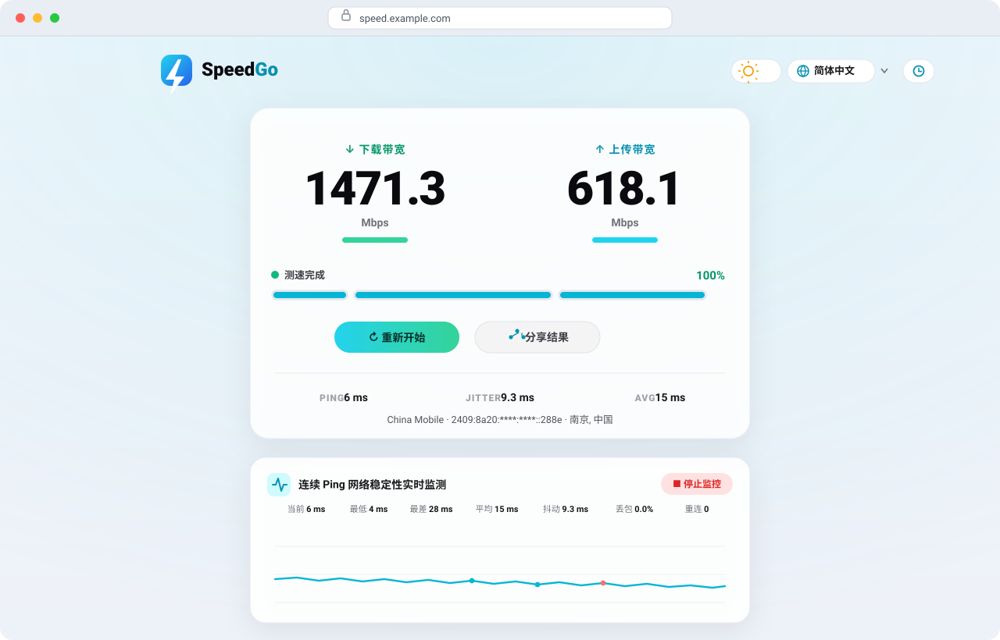
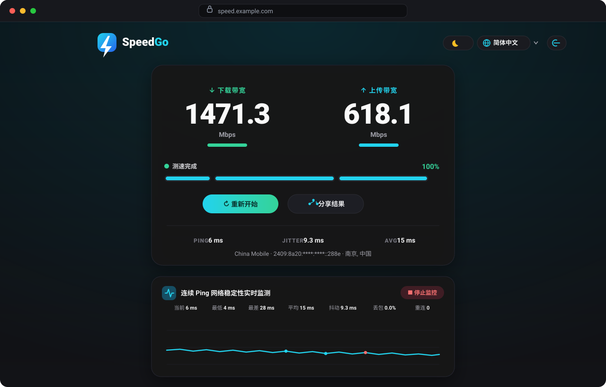
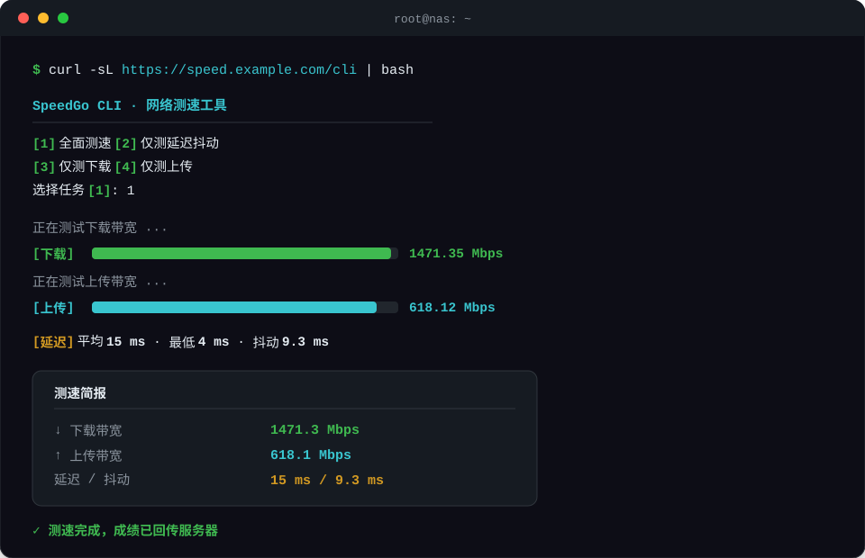

<div align="center">


# SpeedGo

**现代化、轻量化、极低内存占用的高性能网络测速系统**

[](https://go.dev/)
[](https://react.dev/)
[](https://github.com/TeemoSun/Speed-Go/pkgs/container/speed-go)
[](./LICENSE)

[简体中文](./README.md) | [English](./README.en.md)

</div>

---

📸 **界面预览**

| 🌞 浅色模式 | 🌙 暗黑模式 |
| :---: | :---: |
|  |  |

| 💻 终端 CLI 测速 |
| :---: |
|  |

---

## ✨ 核心特性

### 🚄 高性能 Go 流量引擎

- **下载测速**：基于 8MB 不可压缩只读内存循环流，服务端**零堆内存分配（0-Allocation）**，单机单核轻松跑满万兆（10Gbps+）带宽；
- **上传测速**：基于 `sync.Pool` 32KB 缓冲与 `io.Discard` 流式抛弃，服务端单连接内存恒定在 **32KB** 以内；
- **客户端防爆内存**：前端全面采用 Fetch API `ReadableStream` 流式读取、随读随销，万兆测速下浏览器内存稳定保持在 **<20MB**。

### 📈 连续 Ping 与网络稳定性监控

- 基于全双工 WebSocket 长连接，200ms 高频双向毫秒级时间戳探针；
- 实时统计：**当前 / 最低 / 最差 / 平均延迟、加权抖动、丢包率、断网重连次数**；
- Canvas 绘制 60 秒平滑时序折线，红点直观标明丢包与瞬时抖动。

### 💻 终端 CLI 交互式测速

- 无需安装任何客户端，Linux 服务器 / 路由器一条命令直接测速：
  ```bash
  curl -sL http://your-speedtest-domain.com/cli | bash
  ```
- 纯 ANSI 彩色交互菜单、动态平滑进度条、格式化测速简报，成绩自动回传服务器。

### 🛡️ 离线 IP 库与隐私脱敏

- 内置 MaxMind MMDB 离线库，毫秒级解析国家、省市、运营商（ISP/ASN），**零外部 API 依赖**；
- 穿透 Cloudflare / Nginx 反向代理，支持私网（LAN）与回环自动识别；
- 历史与公开记录强制 IP 脱敏（如 `114.***.***.12` / `2409:8a20:****:****::288e`）。

### 💾 双层持久化与设备绑定

- Cookie 仅存 <100 字节的设备唯一 Token，避免 Cookie 4KB 溢出；
- 基于 **Pure-Go SQLite**（免 CGO 交叉编译），WAL 模式高并发读写；
- 区分「我的历史记录」与「全网公开脱敏记录」，支持一键分享测速成绩。

### 🎨 现代化 Web UI

- React 19 + Tailwind CSS，圆角磨砂玻璃拟态设计，暗黑模式；
- 12 种语言智能切换（Cookie → GeoIP 推荐 → 浏览器语言），右上角无刷新热切换；
- 前端经 `go:embed` 内嵌，**编译产物为单一二进制文件（约 15MB），随拷随跑**。

---

## 🚀 快速开始

### 方式一：Docker Compose（推荐）

```bash
mkdir -p data && cat > docker-compose.yml <<'EOF'
services:
  speedgo:
    image: ghcr.io/teemosun/speed-go:latest
    container_name: speedgo
    restart: unless-stopped
    ports:
      - "8080:8080"
    volumes:
      - ./data:/data          # SQLite 数据库持久化
    environment:
      - TZ=Asia/Shanghai
      # 反向代理信任开关：置于 Nginx / Cloudflare 后时务必开启
      - SPEEDGO_TRUST_PROXY=false
      # CLI 测速脚本使用的公网基准地址（可选）
      # - SPEEDGO_PUBLIC_URL=https://speed.example.com
EOF

docker compose up -d
```

> [!TIP]
> 升级版本只需 `docker compose pull && docker compose up -d`，挂载到宿主机 `./data` 的历史数据完全不受影响。

### 方式二：Docker CLI

```bash
docker run -d \
  --name speedgo \
  -p 8080:8080 \
  -v $(pwd)/data:/data \
  -e TZ=Asia/Shanghai \
  -e SPEEDGO_TRUST_PROXY=false \
  --restart unless-stopped \
  ghcr.io/teemosun/speed-go:latest
```

### 方式三：源码编译运行

```bash
go build -o speedgo ./cmd/speedgo
./speedgo --port 8080 --db ./data/speedgo.db
```

启动后访问 `http://your-server-ip:8080` 即可开始测速。

---

## ⚙️ 配置参数

支持**环境变量**（Docker `environment` / `.env`）与**命令行标志**两种方式：

| 环境变量 | 命令行标志 | 默认值 | 说明 |
| :--- | :--- | :--- | :--- |
| `SPEEDGO_PORT` | `--port` | `8080` | HTTP 服务监听端口 |
| `SPEEDGO_DB` | `--db` | `./data/speedgo.db` | SQLite 数据库路径（容器内为 `/data/speedgo.db`） |
| `SPEEDGO_TRUST_PROXY` | `--trust-proxy` | `false` | 反代信任开关：置于受信任反代后设为 `true` 以解析真实 IP |
| `SPEEDGO_PUBLIC_URL` | `--public-url` | 空 | 公网基础地址，CLI 脚本优先以此连接 |
| `SPEEDGO_MAX_TIME` | `--max-time` | `30` | 测速单阶段最大保护超时（秒） |
| `SPEEDGO_MAX_CHUNK` | `--max-chunk` | `512` | 单次下载分块上限（MB） |
| `SPEEDGO_CORS` | `--cors` | `true` | 是否开启全局 CORS |
| `TZ` | - | `Asia/Shanghai` | 容器时区 |

---

## 💻 CLI 用法

```bash
curl -sL http://your-server-ip:8080/cli | bash
```

支持跳过菜单直接执行指定任务：

```bash
curl -sL http://your-server:8080/cli | bash -s -- 1   # 全面测速（默认）
curl -sL http://your-server:8080/cli | bash -s -- 2   # 仅延迟与抖动
curl -sL http://your-server:8080/cli | bash -s -- 3   # 仅下载带宽
curl -sL http://your-server:8080/cli | bash -s -- 4   # 仅上传带宽
```

---

## 🛠️ 本地开发

```bash
git clone https://github.com/TeemoSun/Speed-Go.git
cd Speed-Go

# 前端开发（热重载，API 自动代理到 8080）
cd web && npm install && npm run dev

# 构建前端产物并编译 Go（静态资源经 go:embed 内嵌）
cd web && npm run build && cd .. && go build -o speedgo ./cmd/speedgo
```

## 🤝 贡献

欢迎提交 [Issue](https://github.com/TeemoSun/Speed-Go/issues) 与 Pull Request！

## 📄 许可证

[MIT](./LICENSE) © 2026 TeemoSun
